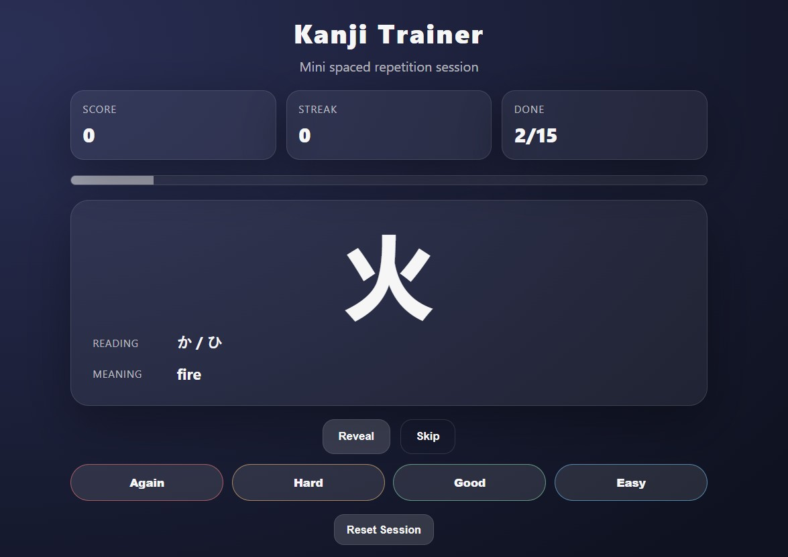

# k8s-kanji-webapp

Mini Kanji spaced repetition trainer deployed with **Docker** and **Kubernetes**.

This project demonstrates how to containerize a Node.js web application and deploy it using Kubernetes.

---

## Features

- Reveal reading and meaning
- Self-grade buttons: **Again / Hard / Good / Easy**
- Score tracking and streak system
- Session goal progress bar
- Weighted reappearance of difficult cards (simple spaced repetition)

---

## Project Structure

```
k8s-kanji-webapp
│
├── server.js
├── package.json
├── kanji.json
├── Dockerfile
├── .dockerignore
│
├── public/
│   ├── index.html
│   ├── app.js
│   └── style.css
│
└── k8s/
    ├── deployment.yaml
    └── service.yaml
```

---

## Run Locally (Node.js)

Install dependencies and start the application:

```bash
npm install
npm start
```

Open your browser:

```
http://localhost:3000
```

---

## Run with Docker

Build the Docker image:

```bash
docker build -t kanji-trainer:1.0 .
```

Run the container:

```bash
docker run -p 3000:3000 kanji-trainer:1.0
```

Open the app:

```
http://localhost:3000
```

---

## Deploying the App to Kubernetes

This project includes Kubernetes configuration files in the **k8s/** directory.

### 1. Build the Docker image

```bash
docker build -t kanji-trainer:1.0 .
```

### 2. Deploy to Kubernetes

```bash
kubectl apply -f k8s/deployment.yaml
kubectl apply -f k8s/service.yaml
```

### 3. Verify the deployment

```bash
kubectl get pods
kubectl get services
```

You should see the application pods running.

---

## Accessing the Application

When running Kubernetes locally, the easiest way to access the service is with port forwarding.

```bash
kubectl port-forward svc/kanji-service 8080:80
```

Then open your browser:

```
http://localhost:8080
```

---

## Stopping the Application

Stop port forwarding by pressing:

```
CTRL + C
```

To remove the Kubernetes deployment:

```bash
kubectl delete -f k8s/deployment.yaml
kubectl delete -f k8s/service.yaml
```

---

## Demo

Kanji Trainer running in Kubernetes locally.



---

## Technologies Used

- Node.js
- Express
- Docker
- Kubernetes
- GitHub

---

## Purpose of the Project

This project was created as part of a DevOps exercise to demonstrate:

- Containerization with Docker
- Application deployment with Kubernetes
- Source control and collaboration using GitHub
